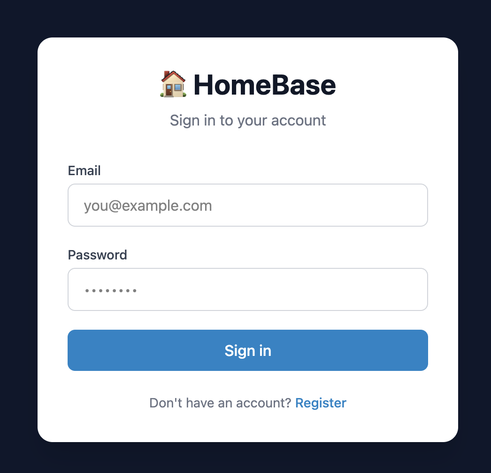
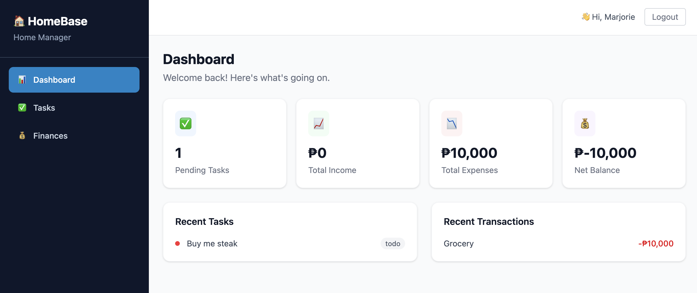
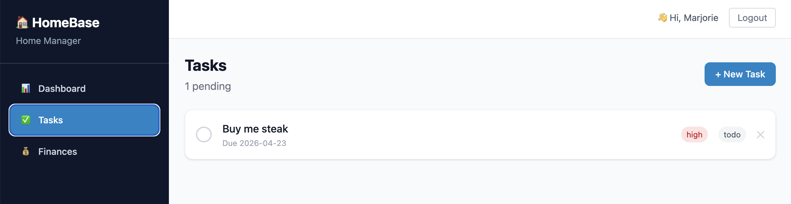
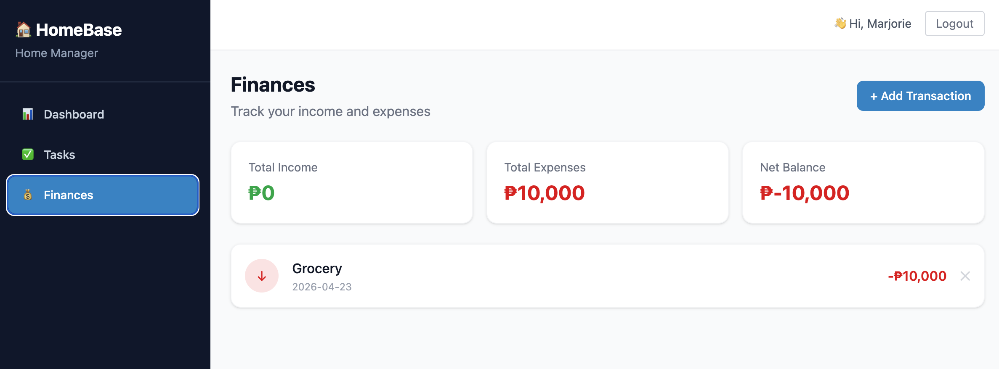

# 🏠 HomeBase

A full-stack home management application for tracking household tasks and finances, built as a personal learning project to explore modern software engineering practices.

> **Live App:** [https://ambitious-coast-0fccf8b00.7.azurestaticapps.net](https://ambitious-coast-0fccf8b00.7.azurestaticapps.net)  
> **API:** [https://homebase-api.azurewebsites.net/docs](https://homebase-api.azurewebsites.net/docs)

---

## Screenshots

### Login


### Dashboard


### Tasks


### Finances


---

## Features

- **Authentication** — secure registration and login with JWT tokens
- **Household management** — shared workspace for multiple users
- **Task tracking** — create, assign, prioritise, and complete tasks with due dates
- **Finance tracking** — log income and expenses with categories
- **Dashboard** — real-time summary of pending tasks and financial balance
- **Responsive UI** — works on both desktop and mobile

---

## Architecture

```
┌─────────────────────────────────────────────────────────┐
│                        Internet                         │
└───────────────────┬─────────────────────────────────────┘
                    │
        ┌───────────┴───────────┐
        │                       │
┌───────▼────────┐    ┌─────────▼────────┐
│  Azure Static  │    │  Azure App       │
│  Web Apps      │    │  Service (F1)    │
│  (React)       │───▶│  (FastAPI)       │
└────────────────┘    └─────────┬────────┘
                                │
                      ┌─────────▼────────┐
                      │  Azure Database  │
                      │  for PostgreSQL  │
                      └──────────────────┘

CI/CD Pipeline (Azure DevOps)
┌──────────┐    ┌──────────┐    ┌──────────┐
│  Test    │───▶│  Build   │───▶│  Deploy  │
│ (pytest) │    │ (Docker) │    │  (ACR →  │
│  + ruff  │    │  linux/  │    │  App Svc)│
└──────────┘    │  amd64   │    └──────────┘
                └──────────┘
```

---

## Tech Stack

### Backend
| Technology | Purpose |
|---|---|
| Python 3.11 | Core language |
| FastAPI | REST API framework |
| SQLAlchemy | ORM — database models and queries |
| Alembic | Database migrations |
| PostgreSQL | Relational database |
| Pydantic | Data validation and serialisation |
| JWT (python-jose) | Authentication tokens |
| bcrypt (passlib) | Password hashing |
| pytest | Testing framework |
| Ruff | Linting and formatting |

### Frontend
| Technology | Purpose |
|---|---|
| React 18 | UI framework |
| TypeScript | Type-safe JavaScript |
| Vite | Build tool |
| Tailwind CSS v4 | Utility-first styling |
| React Router | Client-side routing |
| TanStack Query | Server state management |
| Axios | HTTP client |

### Infrastructure
| Technology | Purpose |
|---|---|
| Docker | Containerisation |
| Azure App Service | Backend hosting |
| Azure Static Web Apps | Frontend hosting |
| Azure Database for PostgreSQL | Managed database |
| Azure Container Registry | Docker image storage |
| Azure DevOps Pipelines | CI/CD automation |
| GitHub | Source control |

---

## Project Structure

```
homebase/
├── backend/
│   ├── app/
│   │   ├── main.py              # FastAPI application entry point
│   │   ├── config.py            # Environment configuration
│   │   ├── database.py          # Database connection
│   │   ├── auth.py              # JWT authentication
│   │   ├── models/              # SQLAlchemy table definitions
│   │   ├── schemas/             # Pydantic request/response schemas
│   │   ├── repositories/        # Database query layer
│   │   ├── services/            # Business logic layer
│   │   └── routers/             # API endpoint definitions
│   ├── tests/                   # pytest test suite (95% coverage)
│   ├── alembic/                 # Database migrations
│   ├── Dockerfile               # Container definition
│   └── requirements.txt         # Python dependencies
├── frontend/
│   ├── src/
│   │   ├── api/                 # Axios API client functions
│   │   ├── components/          # Reusable React components
│   │   ├── hooks/               # Custom React hooks
│   │   ├── pages/               # Page components
│   │   └── types/               # TypeScript type definitions
│   └── package.json
├── docker-compose.yml           # Local development setup
├── azure-pipelines.yml          # CI/CD pipeline definition
└── README.md
```

---

## Design Patterns

This project was built with a focus on learning real-world software engineering patterns:

- **Repository pattern** — all database queries isolated in repository classes
- **Service layer** — business logic separated from API routing
- **DTO pattern** — Pydantic schemas separate API contracts from database models
- **Dependency injection** — FastAPI's native DI system for database sessions and auth
- **JWT authentication** — stateless token-based auth with bcrypt password hashing

---

## Local Development

### Prerequisites
- Python 3.11+
- Node.js 18+
- Docker Desktop

### Backend setup

```bash
# Clone the repository
git clone https://github.com/marjtecson07/homebase.git
cd homebase

# Create and activate virtual environment
python3 -m venv venv
source venv/bin/activate

# Install dependencies
pip install -r backend/requirements.txt

# Start the database
docker-compose up -d db

# Create .env file
cp backend/.env.example backend/.env
# Edit .env with your local database credentials

# Run migrations
cd backend
alembic upgrade head

# Start the API server
uvicorn app.main:app --reload
```

API will be available at `http://localhost:8000`  
Interactive docs at `http://localhost:8000/docs`

### Frontend setup

```bash
# From the homebase root
cd frontend
npm install
npm run dev
```

Frontend will be available at `http://localhost:5173`

### Running tests

```bash
cd backend
pytest --cov=app --cov-report=term-missing
```

---

## CI/CD Pipeline

Every push to `main` that includes backend changes automatically triggers the Azure DevOps pipeline:

1. **Test stage** — runs `ruff` linting and `pytest` test suite
2. **Build stage** — builds Docker image for `linux/amd64`
3. **Deploy stage** — pushes to Azure Container Registry and deploys to App Service

A failed test or lint error blocks deployment automatically.

---

## Environment Variables

### Backend (.env)

| Variable | Description |
|---|---|
| `DATABASE_URL` | PostgreSQL connection string |
| `SECRET_KEY` | JWT signing secret (generate with `python3 -c "import secrets; print(secrets.token_hex(32))"`) |
| `ALGORITHM` | JWT algorithm (default: `HS256`) |
| `ACCESS_TOKEN_EXPIRE_MINUTES` | Token expiry duration (default: `30`) |
| `ALLOWED_ORIGINS` | Comma-separated list of allowed CORS origins |

---

## What I Learned

This project was built during a career break as a learning exercise to broaden from niche ERP (Microsoft Dynamics 365 / X++) development into modern full-stack engineering. Key skills developed:

- Building REST APIs from scratch with proper layered architecture
- Relational database design and migration management
- React with TypeScript and modern state management
- Containerisation with Docker and multi-platform builds
- Cloud deployment on Azure (App Service, PostgreSQL, Static Web Apps, ACR)
- CI/CD pipeline design with automated testing gates
- Test-driven thinking with 95% code coverage

---

## Roadmap

- [ ] Household invite system (join via invite link)
- [ ] User-defined task categories and priorities
- [ ] Account tracking for expenses (which bank account / card)
- [ ] Budget vs actuals chart on finance dashboard
- [ ] Recurring task automation
- [ ] Mobile app (React Native)

---

## Author

**Marjorie Tecson**  
[GitHub](https://github.com/marjtecson07) · 

*Built as a personal upskilling project — from ERP developer to full-stack engineer.*
